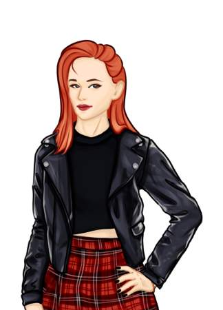

# Разработка визуальной новеллы на движке Ren'Py

Выполнили:

Догадина И.А., Котова Д.А. студентки гр. 19-ПМ-1

Балина М.А. студентка гр. 19-ПМ-2

Проверил: Рыбин А.В.

Нижний Новгород, 2022


## Содержание

  - [Содержание](#содержание)
  - [Введение](#введение)
  - [Глава 1. Сравнение движков для программирования визуальных новелл](#глава-1-сравнение-движков-для-программирования-визуальных-новелл)
    - [1.1. Ren’Py](#11-renpy)
    - [1.2. TyranoBuilder](#12-tyranobuilder)
    - [1.3. Novelty](#13-novelty)
    - [1.4. Сравнение и выбор движка](#14-сравнение-и-выбор-движка)
  - [Глава 2. Сценарий игры](#глава-2-сценарий-игры)
    - [2.1 Mindmap](#21-mindmap)
    - [2.2 Сюжет игры, основные сюжетные линии и концовки](#22-сюжет-игры-основные-сюжетные-линии-и-концовки)
  - [Глава 3. Графическое и музыкальное сопровождение](#глава-3-графическое-и-музыкальное-сопровождение)
    - [3.1 Персонажи игры и фоновые изображения](#31-персонажи-игры-и-фоновые-изображения)
    - [3.2 Музыкальное и видео- сопровождение](#32-музыкальное-и-видео--сопровождение)
    - [3.3 Графическая оболочка игры](#33-графическая-оболочка-игры)
  - [Глава 4. Программирование игры](#глава-4-программирование-игры)
    - [4.1 Синтаксис Ren’Py](#41-синтаксис-renpy)
    - [4.2 Программирование сюжета и геймплея игры](#42-программирование-сюжета-и-геймплея-игры)
  - [Глава 5. Тестирование игры](#глава-5-тестирование-игры)
  - [Глава 6. Релиз игры](#глава-6-релиз-игры)
  - [Заключение](#заключение)
  - [Библиографический список](#библиографический-список)


## Введение

Сфера разработки компьютерных игр довольна широка и необъятна. История 
компьютерных игр идет с далеких 40 - х годов XX века и к нашему времени их
существует бесчисленное множество.

Программист, выбравший сферу своих профессиональных интересов –
разработку компьютерных игр сразу же столкнется с огромными трудностями в
этом сложном деле – необходимы знания не только какого-либо языка
программирования, но и математического аппарата для описания физических
процессов, логических путей и т.д.

Однако не все трудности встретятся при разработке: каждый игровой жанр
предполагает свои особенности разработки. Жанр игры определяется, ориентируясь
на целевую аудиторию. Основными жанрами являются:

1. Действие
2. Симулятор
3. Стратегия
4. Ролевая игра
5. Приключение
6. Головоломка
7. Смешанные жанры

В зависимости от жанра выбирается игровой движок, на котором будет
написана игра. Далее сценаристы пишут сюжет, музыканты пишут музыку для
игры, программисты разрабатывают логику, физику, геймплей игры, тестировщики
тестируют и т.д. В конечном итоге выходит готовый продукт, который можно
использовать как в коммерческих, так и не в коммерческих целях.

В данной курсовой работе будет разработана визуальная новелла, т.е. игра в
жанре «Ролевая игра» на движке для разработки визуальных новелл.

Цель работы: разработать визуальную новеллу с помощью движка для
разработки визуальных новелл.

Задачи:

1. Выбрать движок для программирования;
2. Написать сценарий игры;
3. Отрисовать персонажей игры, найти музыкальное сопровождение, фоновые
    изображения, создать видеосопровождение, индивидуальную графическую
    оболочку игры;
4. Запрограммировать логику и геймплей игры;
5. Тестировать игру;
6. Собрать проект, выложить в открытый доступ и распространять.


## Глава 1. Сравнение движков для программирования визуальных новелл

Прежде чем выбрать движок необходимо ознакомиться с основными
движками для разработки и взвесить все их плюсы и минусы. В этой главе будут
рассматриваться и сравниваться 3 движка для разработки визуальных новелл.

### 1.1. Ren’Py

Ren’Py — это бесплатный, свободный и открытый движок для создания как
некоммерческих, так и коммерческих визуальных романов (графических квестов с
диалоговой системой) в 2D-графике, т.е. исходный код движка при необходимости
можно изменять под свои нужды.

Также движок является кроссплатформенным и поддерживает любые из
существующих систем. Для пользования движком или игрой на Ren’Py не требуется
установка сред для выполнения, драйверов и подобного. Он имеет большую
техническую поддержку, а последняя его версия вышла 10 сентября 2022 года.

Синтаксис языка Ren’Py прост, то есть для разработки требуются навыки
программирования. Так же интуитивно понятен лаунчер для запуска и
редактирования проектов - он поддерживает русский язык.

В Ren'Py реализованы все базовые функции для взаимодействия с игрой -
меню, сохранение, загрузка, масштабирование, изменение настроек игры и многие
другие, а также сохраняется возможность добавлять свои функции.

Движок позволяет изменять стили и внешний вид кнопок, панелей и других
компонентов интерфейса исходного проекта.

Загрузка изображений происходит в фоновом режиме для того, чтобы
пользователь не ждал загрузки образов с диска.

Помимо работы с любыми платформами Ren'Py совместим с практическими
любыми форматами изображений, видео, музыки и шрифтов.


### 1.2. TyranoBuilder

TyranoBuilder также предназначен именно для разработки новелл, но является
платным. Из этого следует, что исходный код закрытый. Однако созданные игры
можно распространять без лицензии.

Поддерживает Windows и MacOS. Для переноса на другие платформы, в том
числе и мобильные, необходимо использовать стороннее программное обеспечение.
Для экспорта на Android требуется редактирование кода в Android Studio. Последняя
версия программа вышла 27 марта 2015 года.

Программа понятна интуитивно, и для создания игр не требуются навыки
программирования - требуется лишь добавлять нужные элементы: диалоги,
графику, звук, видео и т.д. Так же можно добавлять свои скрипты с помощью языка
TyranoScript.

TyranoBuilder не поддерживает русский язык. Так же программа совместима
не со всеми форматами файлов.

Техническая поддержка программы осуществляется лишь на японском языке,
то есть на языке самих разработчиков TyranoBuilder.

### 1.3. Novelty

Novelty — это бесплатный создатель игр, предназначенный для создания
визуальных романов. Его можно модифицировать, и программа позволяет это
свободно делать.

Программа поддерживает только Windows и английский язык. Совместима
она с большинством стандартных форматов файлов. Последняя ее версия вышла 14
декабря 2010 года.

Также как и TyranoBuilder, Novelty не требует навыков программирования –
игры создаются в визуальной системе псевдопрограммирования, которая позволяет
настраивать игровые события и ветви историй с помощью интерфейса. Для расширения возможностей программы можно использовать язык сценариев,
написанный на С++ и Java.

### 1.4. Сравнение и выбор движка

Для выбора движка сравним их по основным характеристикам – сравнение
представлено в таблице 1.


Характеристики сравнения | Ren’Py | TyranoBuilder | Novelty
--|--|--|--
Платный | Нет | Да | Нет
Кроссплатформенность | Все системы | Все, кроме Linux | Только Windows
Навыки программирования | Требуются | Не требуются | Не требуются
Простота | Простой синтаксис языка | Интуитивно понятная программа | Интуитивно понятная программа
Поддержка русского языка | Да | Нет | Нет
Совместимость c форматами файлов | Почти все | Немногие | Большинство
Техническая поддержка | Постоянная | На японском языке | Форумы пользователей

Таблица 1 – Сравнение движков Ren’Py, TyranoBuilder и Novelty

Так как нам важно иметь бесплатный движок, который экспортирует игры на
все платформы, и нас не пугает программирование, для разработки новеллы был
выбран движок Ren’Py.


## Глава 2. Сценарий игры

Для написания сценария игры нужно руководствоваться всеми его правилами:
обозначить главных и второстепенных героев, определить сцены и их количество, а
также делить на акты: завязка, развитие действия, кульминация.

### 2.1 Mindmap

Сценарий игры, тем более новеллы с возможностью выбора, предполагает
множественное разветвление сюжета. Для более информативного представления
сюжета игры удобно представлять его в виде mindmap (диаграмма связей, карта
мыслей) – метод структуризации и визуализации концепций с использованием
графической записи в виде диаграммы, т.е. в виде блоков, соединенных между собой
связями.

Сюжет для данной новеллы был написан именно в виде mindmap. Небольшая
часть представлена на рисунке 1.


Рисунок 1 – Часть сюжета новеллы

### 2.2 Сюжет игры, основные сюжетные линии и концовки

Игра повествует об обычном парне Грише, который учится в воображаемом
университете - Унитех, где взаимодействует со своими одногруппниками и делает
выборы, влияющие на дальнейшие события.

Основными персонажами являются:

1. Автор – закадровый персонаж, поясняющий действия и события,
    происходящие в игре;
2. Гриша Орехов – главный герой, от его лица идет повествование игры, его
    характер и отношения с другими героями зависят от выборов игрока;
3. Ангелина Муравьева – староста группы, добрая, готова помочь своим
    друзьям, не предает, в стрессовых ситуациях ищет поддержку близких,
    внешность: светлые волосы, милое лицо;
4. Лёня Лукьянов – отличник, немного занудный, неуверенный в себе перед
    противоположным полом, не злой и не агрессивный, но в стрессовых
    ситуациях не контролирует эмоции, одевается нелепо, на протяжении всей
    игры пытается понравится Вале;
5. Валя Лаврентьева – оторва и душа компании, ведомая, мнение окружающих
    и близких для нее важно, в стрессовых ситуациях отстраняется от людей,
    имеет яркие волосы, одевается красиво.

Соответственно, существует 3 линии сюжета: линия Гриши, линия Лёни и
Вали, линия Ангелины.

Игра состоит из 5 эпизодов:
1. 1 сентября – Гриша впервые приходит в «Унитех» и знакомится со
своими одногруппниками;
2. 1 курс – Гриша сдает первые экзамены, вспоминая все интересное, что
произошло за этот курс;
3. 2 курс – Расследование пропажи Вали;
4. 3 курс – Ангелина участвует в конкурсе красоты «Мисс Унитех 2022»;
5. 4 курс – Гриша сдает госэкзамен; подведение итогов всех 4 лет
обучения.

Каждая сюжетная линия имеет 3 концовки: плохая, обычная, хорошая. При
комбинации всех плохих концовок, игрок получает общую очень плохую концовку
игры, при комбинации всех хороших – лучшую общую, иначе – стандартную
общую.


## Глава 3. Графическое и музыкальное сопровождение

Любая игра имеет графическое и музыкальное сопровождение – это важная
часть визуализации сюжета. Для новелл это необходимо, так как все внимание
игрока сосредоточено на том, как выглядят персонажи, в каком месте они находятся,
какие эмоции испытывают и т.д. Все это в совокупности при правильном подборе
сопровождения позволяет окунуть игрока как можно глубже в сюжет и передать весь
авторский замысел.

### 3.1 Персонажи игры и фоновые изображения

Все фоновые изображения локаций были взяты из открытых, бесплатных
источников с добавлением визуальных эффектов с помощью графического
редактора Photoshop и имеют расширение .jpg и размер 1920*1080 пикселей.

Чтобы приступить к отрисовке персонажей нужно сначала разобраться в их
характерах, стилях поведения и отличиях от других героях, потому что каждый
человек по своей природе уникален и это особенно важно при создании различных
обликов в игре. Перед тем как приступить к работе у каждого персонажа были
выделены его особенности, по которым игроку будет легче отличить одного героя
от другого – будь то цвет волос, лицо или одежда. Для каждого персонажа был
выбран его собственный стиль, подходящий под его характер и особенные черты.
Так, например, Валя является веселой и легкой на подъем девушкой, поэтому и
одевается соответствующе – в стиле гранж. Леня же наоборот, тихий и скромный
парень и ему подходит более классическая одежда.

Также для узнаваемости персонажей им были выбраны разные цветовые
гаммы, чтобы они не сливались, когда находятся в сцене вместе – кто-то выглядит
более ярко, для кого-то выбираются пастельные оттенки, что так же подчеркивает
разницу в их характерах.

В процессе разработки персонажей они меняли свой облик и дорабатывались
для большего соответствия своим образам, что представлено на рисунках 1-2.

 

Рисунок 1 – Первоначальный и конечный образ Вали

 

Рисунок 2 – Первоначальный и конечный образ Лёни

Для отрисовки персонажей был выбран упрощенный стиль без явной
схожести с классической мультипликационной рисовкой, но и без акцента на
фотореалистичность. Для рисования героев был использован графический редактор
PaintTool SAI, в котором нет стольких инструментов для обработки и улучшения
фото или картинок как, например, в редакторе Adobe Photoshop, но есть все
необходимое для рисования – поддержка слоев, стабилизатор кисти для более
плавных линий, различные кисти, ластик, заливка и система выделения на слоях.
Это достаточно простое в освоении и использовании приложение для художников,
которым не требуется излишняя реалистичность в работах. Поэтому SAI и был
выбран в качестве основного редактора для отрисовки персонажей.

Помимо графического редактора для работы был использован графический
планшет, который упрощает работу диджитал-художникам, позволяя управлять
пером для рисования на компьютере как карандашом или кистью при работе с
бумагой.

Таким образом, с помощью анализа характера и особенностей героев и
современных технологий, используемых для диджитал-рисования, был разработан
концепт внешности героев и реализовано их представление в игре.

### 3.2 Музыкальное и видео- сопровождение

Фоновая музыка также взята из открытых источников, но некоторая имеет
авторские права, что не является проблемой, так как готовая игра используется не в коммерческих целях.

Для анонсирования игры был сделан тизер-трейлер с представлением
персонажей, локаций, краткого описания сюжета и системы принятия решений в
визуальной новелле. Монтаж был реализован в видеоредакторе Adobe Premiere Pro
с использованием персонажей, локаций и скриншотов с различными выборами из
самой игры. Идея ролика была взята из рекламы продуктов компании Apple и
переделана под стиль новеллы, чтобы с помощью динамичного видео показать
главные механики игры, заинтересовать будущих игроков и показать им то, что их
ожидает в процессе прохождения.

В таком же видеоредакторе были сделаны титры игры, а также видеоролик со
скримером для 1 эпизода игры.

### 3.3 Графическая оболочка игры

При создании чистого проекта в лаунчере Ren’Py создается исходная
графическая оболочка, для которой существует возможность изменения. Исходная
оболочка представлена на рисунках 3 - 5.


Рисунок 3 – Исходная оболочка игры (главное меню)


Рисунок 4 – Исходная оболочка игры (меню)


Рисунок 5 – Исходная оболочка игры (диалоги)

В данном проекте в исходной оболочке было изменено:

1. Шрифты: KTFJermilov-Solid – для меню и UZSans – для внутриигровых
    диалогов, а также их размеры в различных экранах;
2. Расположение названия игры в главном меню;
3. Статическое фоновое изображение в главном меню на видео;
4. Количество кнопок в меню: в главном и игровом убрана кнопка «Помощь»,
    в игровом нижнем меню были оставлены: кнопка «Опции», которая была
    переименована в «Меню», кнопка «Сохранить», кнопка «История».
5. Цветовая гамма всех экранов и кнопок;
6. Значок игры;
7. Отображение открытых концовок.

Наглядное представление изменений – на рисунках 6 - 8.


Рисунок 6 – Измененная оболочка игры (главное меню)


Рисунок 7 – Измененная оболочка игры (меню)


Рисунок 8 – Измененная оболочка игры (диалоги)


## Глава 4. Программирование игры

Программирование сюжета и геймплея – главная часть создания игры,
которая требует наличие навыков программирования, абстрактного и логического
мышления разработчика.

Весь сюжет данной игры разбит на сцены, т.е. функции, внутри которых
персонажи говорят свои реплики, отображаются фоновые изображения, спрайты
персонажей и другие вспомогательные изображения, включается музыка и видео,
игрок делает выборы, изменяются баллы, т.е. переменные, происходит ветвление
сюжета, в зависимости от баллов, запускается таймер. В этой главе будет
рассматриваться программирование всех этих частей.

### 4.1 Синтаксис Ren’Py

Для программирования сценария необходимо сначала изучить синтаксис
языка Ren’Py – он повторяет синтаксис языка Python, на котором и был написан.

Движок соединяет все файлы формата с расширением `.rpy` в один
интерпретируемый файл, поэтому совершенно не важно в какой
последовательности писать код – его можно делить на удобное количество файлов.

Игра начинается с метки `label start`. Именно она запускается при начале
игры. Любые функции, в том числе и начальная вызываются с помощью служебного
слова `label`. Через пробел следует название метки, потом двоеточие, и на
следующей строке через 1 табуляцию или 4 пробела внутри метки выполняется код.
Метка заканчивается словом `return`.
```
label label_name:
    ...
    return
```

Метку можно вызвать с помощью метода `call` и через пробел название
метки. Соответственно после выполнения вызванной метки, движок будет
выполнять код из исходной метки. Также существует метод `jump` и через пробел
название метки, который позволяет перепрыгнуть на вызванную метку. Из этого
следует, что при окончании вызванной метки игра завершается.

Любая переменная задается словом `define` и названием переменной.
Переменными могут быть все базовые типы данных из Python, например, числа,
строки, логический тип данных, а также персонажи. Последние вызываются
функцией `Character` и входными параметрами являются: имя, цвет имени, тег
изображения и другие.
```
define bool_type = True
define int_type = 0
define name_char = Character(‘Name’, color = #ffffff, image = ‘name’)
```
Изображения задаются через служебное слово `image`, далее идет имя
изображения и этой переменной присваивается путь к изображению. Аудиофайл
задается, как переменная с именем, начинающимся на `audio.`, а значение
переменной - путь к файлу в виде строки.
```
image background_1 = “background_1.jpg”
define audio.main_music = “music/main_music.mp3”
```
Для отображения новой сцены, т.е. для сброса отображаемых до этого
диалогов и персонажей в коде прописывается слово `scene` и имя изображения.
Любые изображения вызываются на сцену словом `show` и скрываются с помощью
`hide`. Дополнительными параметрами для изображения может быть
выравнивание, которое обозначается после вызова этого изображения словом `at` и
через пробел `right`, `left` или `center`. По умолчанию все изображения
выравниваются по центру. Также существуют переходы, применимые к сценам или
изображениям. Основные из них: `fade`, `dissolve`, `move`. Переходы вызываются
с помощью слова `with`.
```
scene background_1 with fade
show image_char at right with dissolve
```
Аудиофайл может быть проигран двумя способами: как звук, т.е. 1 раз, или
как музыка, т.е. с зацикливанием. В первом случае в коде это обозначается как `play sound` и имя звука без префикса `audio.`. В втором - `play music`. Для остановки музыки используется слово `stop` и имя аудиофайла. Для аудиофайлов также
существуют дополнительные параметры, указываемые после вызова аудио,
например: громкость `volume`, принимающая значения типа с плавающей точкой в
диапазоне от 0 до 1, плавность входа и выхода `fadein`, `fadeout`, измеряемые в
количестве секунд затухания. Видео проигрывается с помощью обращения к методу
класса renpy – `renpy.movie_cutscene`, а передается в метод путь к файлу.
```
play music main_music volume 0.5 fadein 1 fadeout 1
$ renpy.movie_cutscene("video.mpeg")
```
Отображение диалогов на экране вызывается с помощью обращения к имени
нужного персонажа и через пробел указывается его текст – строка. Если не указать
персонажа, то фраза будет отображена без имени.
```
char_1 “Hello!”
char_2 “Hi!”
```
Изменение к переменным происходит через знак $. Здесь, как и в Python,
работают операторы составного присваивания.
```
$ bool_type = True
$ int_type += 1
```
Ren’Py поддерживает следующие типы условных операторов: `if-elif-else`,
`while`, а также `pass`. Синтаксис идентичен Python. `pass` – аналог `continue`.
```
$ int_type = 5
while int_type > 1:
    $ int_type -= 1
    if int_type < 1:
        pass
    else:
        int_type = 0
```
Для отображения меню выбора для игрока требуется обозначить его в коде
словом `menu:`. На следующей строчке через 1 табуляцию или 4 пробела пишется
фраза, отображаемая в кнопке выбора, и двоеточие. Также на следующей строке
располагаются все действия, производимые после нажатия на данный выбор.
```
char_1 “What do you want?”
menu:
    “apple”:
        char_2 “I want to eat apple”
    “orange”:
        char_2 “I want to eat orange”
```
Помимо основных механик, требуемых для разработки новелл, имеется
возможность создавать свои: добавлять свои экраны, импортировать библиотеки,
использовать вставки python-кода и т.д., а также использовать дополнительные
методы класса renpy.

### 4.2 Программирование сюжета и геймплея игры

В данной новелле использовалось деление кода на 10 файлов: главный, 5
файлов каждого эпизода игры, импортированная библиотека для подсветки
персонажей, графическая оболочка, экраны, настройки.

В главном файле `main.rpy` инициализируются все персонажи, переменные,
отвечающие за черты характера главного героя (логические типы), ключевые баллы,
такие как сложность игры, баллы взаимодействия с персонажами (целочисленный
тип), баллы экзаменов и т.д. Далее обозначаются пути ко всем файлам звуков и
музыки, используемых в игре, и изображений: как фоновых, так и спрайтов
персонажей. В конце вызывается стартовая метка, внутри которой происходит
вызов меток каждого эпизода.

Структура каждого файла, отвечающего за эпизод игры, строится по одному
и тому же принципу: в начале указывается метка эпизода, в которой вызываются
сцены этого эпизода. В конце эпизода отображается сцена с артом и сообщение в
верхнем левом углу экрана о прохождении эпизода. Сообщение высвечивается с
помощью вызова метода `renpy.notify`, входным параметром которого является
строка сообщения.

Внутри каждой метки вызывается сцена, музыка и некоторое количество
персонажей. В зависимости от метки также могут быть вызваны условные
операторы, видео, несколько сцен, а также разное количество персонажей и их фраз.

1 эпизод игры имеет 5 сцен, в которых используется меню выбора, условные
операторы, а также оператор «pause», приостанавливающий работу кода на
некоторое количество секунд, указанное как входной параметр. Помимо этого, для
определения случайного числа, необходимого для программирования сюжета,использовался метод «renpy.random.randint», генерирующий целое число в
диапазоне, указываемом как параметр метода.

2 эпизод содержит в себе 13 сцен, использующие те же самые меню выбора,
условные операторы. Однако здесь был вызван таймер, специально разработанный
для автоматического выбора в меню по истечению времени. Для его корректной
работы перед непосредственным вызовом экрана таймера необходимо
инициализировать время таймера, диапазон времени, а также метку, которая будет
вызываться при истечении времени. Далее вызывается экран таймера, а при выборе
он исчезает.

В 3 эпизоде имеется 12 сцен, вызывающиеся непоследовательно, т.е. при
определенном выборе игрок может не попасть в некоторые сцены, тем самым пойти
по альтернативной ветке сюжета.

В 4 эпизоде содержится 16 сцен, использующие таймер, а также которые с
определенного момента эпизода разветвляются, предоставляя игроку возможность
выбрать ветку сюжета.

Последний эпизод имеет 12 сцен, в которых используются все стандартные
методы для разработки новелл. Отличием является то, что так как это последний
эпизод, то в конце выводится не сообщение о его прохождении, а сообщения об
открытых концовках игры. Также при открытии концовок константные переменные
этих концовок становятся `True` для отображения в меню.

Также в начале игры игрок выбирает сложность, влияющую на отображение
некоторых выборов и ход сюжета.

В файле `gui.rpy` изменены лишь необходимые параметры такие как, цвет,
размер шрифтов, экрана, кнопок, а также их позиции и интервалы.

Опции игры в файле `options.rpy` также были изменены только по
необходимости. Например, был изменен текст раздела `Об игре`, название игры,
отображаемое в окне, музыка главного меню, иконка игры.

Таймер, необходимый в некоторых эпизодах игры, разработан в файле
`screens.rpy`. В начале задается количество миллисекунд, на которое будет
уменьшаться таймер, и это будет повторяться пока заданное время таймера не
станет отрицательным. При отрицательном значении таймера, скрывается экран
таймера, и вызывается заданная метка перехода.
```
screen countdown:
    timer 0.01 repeat True action If(time > 0, true=SetVariable('time', time - 1),
false=[If(timer_score, true=Hide('countdown'), false=[Hide('countdown'),
Call(timer_call)])])
    bar value time range timer_range xalign 0.5 yalign 0.95 xmaximum 300 at
alpha_dissolve
```
Также был изменен экран выбора на отображение в виде плиток, а не списка.
```
screen choice(items):
    style_prefix "choice"
    vbox:
        if(len(items)==3 or len(items)==2):
            for i in items:
                textbutton i.caption action i.action
        elif (len(items)==4):
            hbox:
                textbutton items[0].caption action items[0].action
                textbutton items[1].caption action items[1].action
            hbox:
                textbutton items[2].caption action items[2].action
                textbutton items[3].caption action items[3].action
        else:
            hbox:
                textbutton items[0].caption action items[0].action
                textbutton items[1].caption action items[1].action
                textbutton items[2].caption action items[2].action
            hbox:
                textbutton items[3].caption action items[3].action
                textbutton items[4].caption action items[4].action
                textbutton items[5].caption action items[5].action
            hbox:
                textbutton items[6].caption action items[6].action
                textbutton items[7].caption action items[7].action
                textbutton items[8].caption action items[8].action
```
Также в файле `screens.rpy` был добавлен экран с отображением открытых
концовок в меню. Он представлен в виде таблицы с условиями отображения текста
и изображений. Использует для проверки константные переменные открытия
концовок, которые становятся `True` при попадании в ту или иную концовку в 5
эпизод.
```
screen ending():
    tag menu
    use game_menu(_("Концовки"), scroll="viewport"):
        style_prefix "ending"
        vbox:
            hbox:
                box_wrap True
                grid 3 1:
                    xfill True
                    vbox:
                        label _("Ангелина")
                        null height gui.pref_spacing
                        if (persistent.ending_angelina_love):
                            text _("Любовь-Морковь")
                        else:
                            text _("ЗАКРЫТО")
                        null height (0.5 * gui.pref_spacing)
                        if (persistent.ending_angelina_friend):
                            text _("Хорошие ДРУЗЬЯ")
                        else:
                            text _("ЗАКРЫТО")
                        null height (0.5 * gui.pref_spacing)
                        if (persistent.ending_angelina_enemy):
                            text _("Ни себе, ни людям")
                        else:
                            text _("ЗАКРЫТО")
                    vbox:
                        label _("Лёня и Валя")
                        null height gui.pref_spacing
                        if (persistent.ending_lyonya_wedding):
                            text _("Эх, свадьба пела и")
                            text _("плясала")
                        else:
                            text _("ЗАКРЫТО")
                        null height (0.5 * gui.pref_spacing)
                        if (persistent.ending_lyonya_wolf):
                            text _("Одинокий волк")
                        else:
                            text _("ЗАКРЫТО")
                        null height (0.5 * gui.pref_spacing)
                        if (persistent.ending_lyonya_otstoi):
                            text _("ДЕЛА ОТСТОЙ")
                        else:
                            text _("ЗАКРЫТО")
                    vbox:
                        label _("Гриша")
                        null height gui.pref_spacing
                        if (persistent.ending_grisha_genius):
                            text _("Гений")
                        else:
                            text _("ЗАКРЫТО")
                        null height (0.5 * gui.pref_spacing)
                        if (persistent.ending_grisha_good_job):
                            text _("Хорошая работа, Гриша")
                        else:
                            text _("ЗАКРЫТО")
                        null height (0.5 * gui.pref_spacing)
                        if (persistent.ending_grisha_loser):
                            text _("Не фортануло")
                        else:
                            text _("ЗАКРЫТО")
            null height (4 * gui.pref_spacing)
            hbox:
                box_wrap True
                vbox:
                    label _("Общие концовки")
                    null height gui.pref_spacing
                    grid 3 2:
                        spacing gui.slot_spacing
                        xfill True
                        if (persistent.ending_best):
                            add "images/art_best_end.jpg"
                        else:
                            add "images/lock.png"
                        if (persistent.ending_standart):
                            add "images/art_neutral_end.jpg"
                        elif (persistent.ending_standart_valya):
                            add "images/art_neutral_end_valya.jpg"
                        else:
                            add "images/lock.png"
                        if (persistent.ending_worth):
                            add "images/art_bad_end.jpg"
                        else:
                            add "images/lock.png"
                        if (persistent.ending_best):
                            text _("Мегахарош")
                        else:
                            text _("ЗАКРЫТО")
                        if (persistent.ending_standart or
                        persistent.ending_standart_valya):
                            text _("Стандарт")
                        else:
                            text _("ЗАКРЫТО")
                        if (persistent.ending_worth):
                            text _("Мегаотстой")
                        else:
                            text _("ЗАКРЫТО")
style ending_text is gui_prompt_text
```
Были закомментированы строки с лишними кнопками в меню, как игровом,
так и главном.


## Глава 5. Тестирование игры

Тестирование программного обеспечения — процесс исследования,
испытания программного продукта, имеющий своей целью проверку соответствия
между реальным поведением программы и её ожидаемым поведением на конечном
наборе тестов, выбранных определённым образом.

Существуют различные способы тестирования игр, и все они завязаны
вокруг концепции избавления от багов в приложении. Приведем несколько
популярных видов тестирования:

1. Функциональное тестирование (Functionality Testing):

Как следует из названия, с помощью функционального тестирования
тестировщики проверяют работоспособность приложения в соответствии с
заданными спецификациями.

Во время процесса тестирования выявляются общие проблемы приложения,
такие как целостность приложения, аудио-видео, масштабируемость, графику и т. д.
Кроме того, проверяется производительность приложения во время
мгновенного перезапуска, выключения и ошибок.

Особенности:
- проверяет производительность продукта;
- этот метод тестирования относится к тестированию по принципу
«черного ящика»;
- занимает немного времени, потому что проверяются цельные
элементы, такие как графика, текст, удобство для пользователей и т.д.

2. Комбинаторное тестирование (Combinational Testing):

Комбинаторное тестирование используется для анализа производительности
игрового приложения. Такой подход к тестированию помогает выявить ошибки на
раннем этапе, что делает процесс разработки более продуктивным.

Во время комбинаторного тестирования применяются различные
комбинации входных данных для проверки соответствия выходных.
Особенности:

- комбинаторное тестирование обеспечивает работоспособность
    продукта со всеми возможными комбинациям параметров;
- отчеты в рамках этого подхода систематичны и просты в
    использовании.

3. Исследовательское тестирование (Exploratory Testing):

В этом методе тестирования команда не работает ни с какими заранее
созданными тест-кейсами. Они тестируют всю систему в процессе ее работы «на
лету». Кроме того, в концепции этого метода тестирования больше внимания
уделяется «изобретательности», чем традиционному тестированию.

Тестировщик должен изучить игровое приложение и выявить ошибки в силу
своих мыслительных способностей.

Прежде чем запускать игровое приложение в открытом доступе, необходимо
провести исследовательское тестирование, так как оно дает тестировщикам больше
пространства для маневра.

В результате тестировщик обнаруживает ошибки наиболее важные с точки
зрения конечных пользователей и делает приложение более идеальным.

4. Play-тестирование (Play Testing):

Как следует из названия, в этом методе тестирования тестировщик должен
играть в игру как игрок. Тестировщик играет от лица игрока и проверяет, появляется ли ошибка.

Кроме того, всякий раз, когда мы тестируем игру, как и игрок, это помогает
выявлять общие проблемы. Также есть возможность проверить все
нефункциональные элементы.

Наряду с этим они также могут оценить уровень развлекательности игрового
приложения. В целом, этот метод тестирования помогает сделать приложение
инновационным, интересным и ориентированным на игроков.

Для данного проекта применялся только Play-метод тестирования, поскольку
корректную работу других основных частей обеспечивает сам движок Ren’Py.
Исследовательское тестирование проводилось по мере прохождения, исправлялись
реплики и эмоции персонажей на более подходящие к сцене. При этом все
изменения предварительно обсуждались с командой разработчиков.

Основные моменты, которые требовали проверку — это логические
переходы в игре, правильное отображение персонажей и реплик, зависимость
сюжета от выбора характера и уровня сложности. Все эти моменты можно
проверить только при помощи Play-метода.

Самые часто возникающие ошибки:

- опечатки в названиях переменных и именах персонажей. Например,
    чтобы отобразить героя Ангелину необходимо вызвать команду `show ang_usual`, зачастую вместо `ang` было указано `Angelina`, и
    персонаж не отображался;
- работа таймера. Таймер является встроенной функцией движка, для
    его работы необходимо задать время работы таймера и функцию
    перехода после окончания времени. Особенностью работы таймера
    является то, что после окончания времени таймера автоматически
    выбирается последний ответ, а это значит, что случайно может
    выбраться правильный ответ. Также при выборе правильного ответа
    игроком, таймер может не остановиться и вызвать функцию проверки
    ответа несколько раз;
- отсутствие команды `return` в конце сцен, из-за чего происходит переход
    сразу к следующей сцене. Все сцены вызываются по списку, в
    зависимости от сюжета, однако если в какой-то из сцен нет ключевой
    команды `return`, то функция не вернется к списку сцен, а пойдет дальше
    и может перейти к сцене, которая не идет по данной ветке;
- отображение меню выбора ответов. В стартовой версии игры все
    выборы отображаются списком, однако в некоторых сценах
    количество вариантов выбора достигает четырех, и они не убираются
    на игровом экране, поэтому было принято решение переписать
    функцию отображения выбора, чтобы если элементов выбора больше
    трех, то они отображались сеткой;
- наличие персонажа по сюжету. Так как по плохой ветке один из
    персонажей не принимает участия в игре после определенных сцен, то
    необходимо было проверить наличие персонажа в дальнейших сценах.
    Иногда возникали ошибки, что по сюжету персонажа быть не должно,
    а в сцене он появился.


## Глава 6. Релиз игры

После прохождения всех этапов разработки: от написания сценария до
конечного тестирования, необходимо собрать проект и распространять его. Движок
Ren’Py облегчает работу разработчика и собирает проект в архив с исполняемыми
файлами сам.

Демоверсия игры включает в себя первый эпизод, а игровое время составляет
примерно 5 минут при условии полного прочтения всех диалогов. Игра доступна
для запуска на таких платформах как: Windows 7+, Linux x86_64/Arm, Mac OS X
10.10+ и занимает 134Мб дискового пространства.

Полная версия игры доступна на тех же платформах и занимает 395 Мб
дискового пространства. Игровое время составляет примерно 40 минут для полного
прохождения на одну концовку с учетом прочтения всех диалогов.


## Заключение

В данной курсовой работе были изучен подробно язык программирования
Python, а также язык движка Ren’Py. Была проделана значительная работа на
каждом этапе разработки игры: написан уникальный сюжет, вручную отрисованы
персонажи, отобраны фоновые изображения и музыкальное сопровождение,
запрограммированы геймплей и логика игры, проведена оптимизация кода,
тестирование.

По итогу игра в себя включает 4 главных персонажа и 14 второстепенных.
Каждый из главных персонажей имеют свою сюжетную линию с тремя концовками.
Игра состоит из 5 эпизодов с общей продолжительностью прохождения около часа.

Демоверсия распространяется бесплатно на [GitHub](https://github.com/nnstu-appmath/visual_novel), а полная версия на
[Яндекс.Диске](https://disk.yandex.ru/d/2oW7A7umCV61zA).

Цель работы, поставленная ранее, была достигнута и необходимые задачи
выполнены.

В дальнейшем планируется исправить все найденные пользователями
ошибки, прислушаться к пожеланиям и предложениям, и если игра найдет большой
отклик от аудитории, то заняться разработкой дополнений (DLC), которые будут
сильнее раскрывать историю персонажей.

## Библиографический список

1. Novelty - Visual novel maker. [Электронный ресурс]. URL:
    https://www.visualnovelty.com/ (Дата обращения: 10.10.2022).
2. Nyu Media: TyranoBuilder Visual Novel Studio. [Электронный ресурс]. URL:
    https://www.nyu-media.com/tyranobuilder-visual-novel-studio (Дата
    обращения: 10.10.2022).
3. The Ren'Py Visual Novel Engine. [Электронный ресурс]. URL:
    https://www.renpy.org/ (Дата обращения: 10.10.2022).
4. Ren'Py documentation. [Электронный ресурс]. URL:
    https://www.renpy.org/doc/html/#the-ren-py-language (Дата обращения:
    03.11.2022).
5. ВикипедиЯ. Свободная энциклопедия.: Ren'Py [Электронный ресурс]. URL:
    https://ru.wikipedia.org/wiki/Ren%27Py. (Дата обращения: 24.09.2022).


